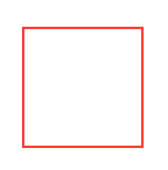
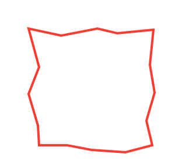

# Chris's SwiftUI Path Subdivide

PathSubdivide takes a shape and subdivides it's paths so you get more segments
on the shape. This is useful if you warping your shapes

Use like

```
Rectangle()
  .subdivide(times: 2)
```

As an extension on `Shape`

```
public extension Shape {
  
  func subdivide(times: Int = 1) -> some Shape {
    return PathSubdivider(shape: self, times: times)
      .subdivide()
  }
  
}
```

| Before | After |
|--------|-------|
|


## Documentation

Documentation website here: https://nthstate.github.io/PathSubdivide/documentation/pathsubdivide/

Building the docs

```
swift build
```

```
PACKAGE_NAME=PathSubdivide
REPOSITORY_NAME=PathSubdivide
OUTPUT_PATH=./docs

swift package --allow-writing-to-directory $OUTPUT_PATH \
    generate-documentation --target $PACKAGE_NAME \
    --disable-indexing \
    --transform-for-static-hosting \
    --hosting-base-path $REPOSITORY_NAME \
    --output-path $OUTPUT_PATH
 ```